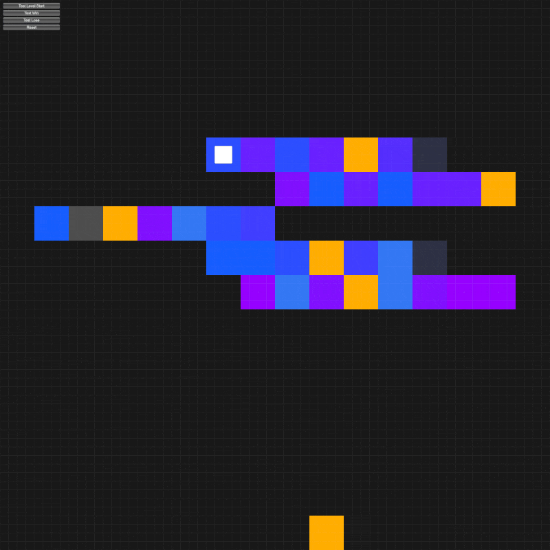

# 🐿️ Blind Squirrel Agent

#### 🥈 2nd Place Winner - [ARC-AGI-3 Preview Competition](https://arcprize.org/competitions/arc-agi-3-preview-agents/)

#### 🔧 Developed by Will Dick 


## How to Run

1. Install [uv](https://docs.astral.sh/uv/getting-started/installation/) if not already installed.
   
   ```bash
   curl -LsSf https://astral.sh/uv/install.sh | sh
   ```

2. Clone this repo branch.
   
   ```bash
   git clone --branch blindsquirrel https://github.com/wd13ca/ARC-AGI-3-Agents.git
   ```

3. Enter the directory.
   
   ```bash
   cd ARC-AGI-3-Agents
   ```

4. Copy .env.example to .env
   
   ```bash
   cp .env.example .env
   ```

5. Get an API key from the [ARC-AGI-3 Website](https://three.arcprize.org/) and set it as an environment variable in your .env file.
   
   ```bash
   export ARC_API_KEY="your_api_key_here"
   ```

6. Run the **Blind Squirrel** agent.
   
   ```bash
   uv run main.py --agent=blindsquirrel
   ```

## About the Competition

ARC-AGI-3 is an artificial general intelligence benchmark in which AI agents must learn to play video games they have never seen before. A successor to ARC-AGI-1 and ARC-AGI-2, ARC-AGI-3 will be released in 2026 with ~100 games. The Preview Competition consisted of 3 public training games and 3 private evaluation games. 

As developers, we had access to the 3 public training games while building our agents. However, final competition scores were based on the 3 private evaluation games, which we did not have access to until the competition was over. This was the key challenge of the competition – our agent needed to be intelligent enough to learn how to play a game it had never seen before. 

*The competition was only four weeks long, and I didn't begin working on my solution until a few days before the competition was over. As a result, the code was rushed and there are many bad design choices and probably a few unnoticed bugs.*

## Game Format

<div align="center"><i>Example Game</i><br></div>

Although every game is novel, they each follow a standard format:

- Each game environment consists of a 64x64 grid, where each cell in the grid is filled with one of 16 different colours. 

- Games are turn-based. Based on the current grid, agents must choose an action. That action then causes the grid to change. 

- The grid change is sometimes expressed as one new grid, and sometimes as a series of new grids that together produce an animation.

- Available actions consist of 5 "basic actions" (equivalent to buttons on a game controller), a click on one of the grid's 64x64 cells, or "reset" which resets the game to the start of the current level. In total, there are 4102 possible actions at each turn, primarily consisting of the different cells that can be clicked on. 

- Games are divided into levels. Games are scored based on the number of levels completed. Agents have access to their current level (score) throughout the game. 

- There is a maximum number of turns per level. If your agent reaches that maximum, it is "game over" and the agent returns to the start of the level.

## Approach

Below, I briefly explain some of the key features of the agent. 

### Key Features

- A **state graph** that allows the agent to avoid actions known to lead to "game over".

- A rules-based **valid actions model**, that reduces the action space and down-weights actions that are unlikely to result in a grid change.

- A neural network-based **action value model**, trained on previous levels, to predict the most valuable action for a given state. 

### State Graph

The state graph stores a history of every previously encountered game state, the actions taken from that state, and the resulting next states. 

The graph was built with a couple of assumptions. I assumed that the games are deterministic: for a given state, a given action will always produce the same result. I also assumed that the game state is determined entirely by the current grid.

The state graph is used to identify and avoid actions that are known to lead to "game over".

### Valid Actions Model

One of the biggest challenges with these games is the number of actions available. Each turn, the agent must choose from one of 4102 actions: 5 "basic actions", 4096 cells that can be clicked on, and 1 reset. 

To reduce the number of actions, I segmented the grid into shapes (i.e. groups of contiguous cells of the same colour) and treated each shape as a single potential "button". In other words, I assumed that if two contiguous cells have the same colour, clicking on one is equivalent to clicking on the other. This reduced the space of possible actions by roughly two orders of magnitude, leading to a much more efficient search of the state space.

Another challenge is that, despite the large space of actions, most actions don't do anything - they leave the grid unchanged, but still use up compute time. I refer to an action as "valid" if it causes a change in the grid, and invalid if it leaves the grid unchanged. 

To address this challenge, I developed a rules-based model for estimating the likelihood that an action would be valid. This model works in tandem with the Action Value Model to determine the next action.

*The winning solution built a neural network-based Valid Actions Model. In retrospect, I'm not sure why I didn't do that. I could have easily put another head on the Action Value Model to determine if an action is valid.*

### Action Value Model

The Action Value Model is a neural network that predicts the value of an action for a given state. 

The model is trained at the end of level 1, and then retrained at the end of every other level. The model isn't used for decisions until the agent gets to the end of level 1. 

To train the model, we use the state graph to measure the distance (in terms of actions) between each state and the level-winning state. This distance is used as the value measure in model training.

The model takes two inputs: the current state (represented as a 64x64 grid) and an action (represented as an embedding). 

The model is built using a pre-trained ResNet-18 with custom stem and custom head. 

The stem converts the grid's 16-possible cell values into a 16-dim embedding and places it through a conv layer before it feeds into the pre-trained backbone.

The head combines the output from the pre-trained backbone with an action embedding to produce the final value prediction.

For click actions, the action embedding incorporates information about the colour, size, and shape of the applicable "button". 

Values from the Action Value Model are combined with scores from the Valid Actions Model to determine the agent's next action.

*A glaring inefficiency in my code is that I am continuously regenerating predictions for the same state rather than caching them.*

## Contact

If you have any questions or comments, feel free to reach out: will@cvmds.ca.
